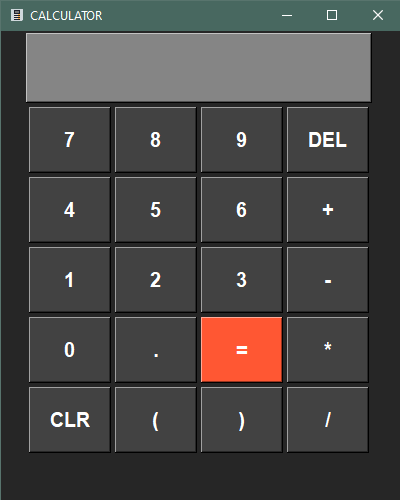

# Desktop GUI Calculator

A Lightweight demo calculator built with Python. Features an interactive interface supporting basic arithmetic operations

## Features
- Arithmetic operations
- Syntax and Math Error
- Clean and Modern UI

## Tech Stack
- Python
- Tkinter (Framework)

## How to Run:
